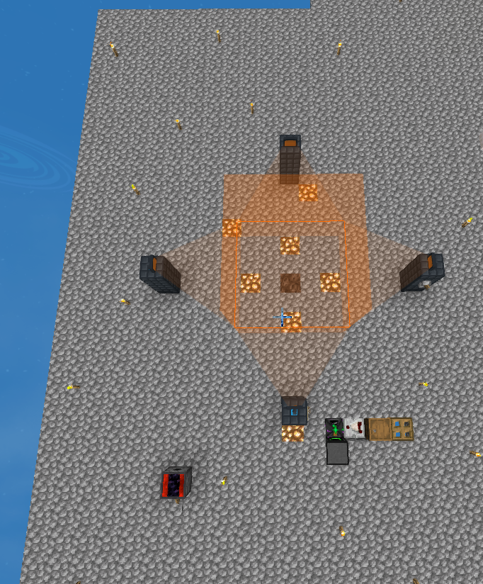

# Project Automation for Compact Machines

## Overview
This project leverages OpenComputer to automate crafting recipes within Compact Machines.

## Installation
To use this automation, your robot needs to be equipped with the following upgrades:
- Angel Upgrade
- Inventory Upgrade
- Inventory Controller Upgrade
- Redstone Card Upgrade

The most crucial component is the highest-tier Database Upgrade, which records all the recipes the robot can support.

## Additional Installation Steps

After installing OpenOS on your robot, please proceed to install OPPM (OpenPrograms Package Manager). OPPM simplifies the management of software packages.
Once OPPM is installed, you can register the software for this project by executing:
    `oppm register zeng-github01/OpenComputer-CMBuilder`
This will allow OPPM to manage the installation, updates, and removal of the software.

## Modifying CMBuilder.lua

`CMBuilder.lua` is the main program that includes the code for the robot to navigate from the starting point to the bottom-left corner of the crafting area. Since each robot's relative position to the target point may vary, you might need to modify this part of the code accordingly. The corresponding positions are commented in both Chinese and English for your convenience.

```lua
-- Move five steps to left
robotLib.move(sides.left,5)

-- Move five steps to right
robotLib.move(sides.left,5)

--Definition document for sides: https://ocdoc.cil.li/api:sides

```



## Database Configuration
The database is configured as follows:
- Each row represents a recipe.
- Slots 1 to 7 contain the raw materials.
- Slot 8 is for the catalyst.
- Slot 9 holds the product of the recipe.

To mark the items, simply right-click to open the database.

## Usage
After installing the necessary upgrades and configuring the database, the robot can autonomously handle the crafting processes within the Compact Machines environment.

For detailed instructions on how to operate the robot and troubleshoot common issues, please refer to the user manual (link to user manual).

## Contribution
Contributions to the project are welcome. Please ensure to follow the contribution guidelines outlined in the CONTRIBUTING.md file.

## License
This project is licensed under the MIT License - see the LICENSE.md file for details.